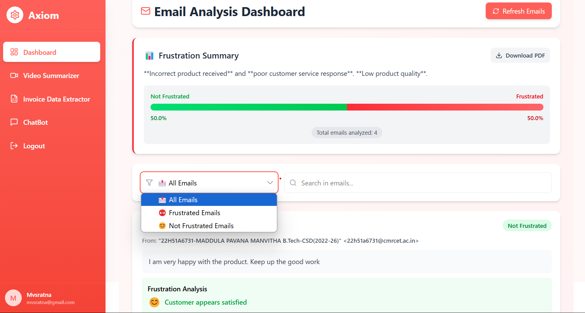
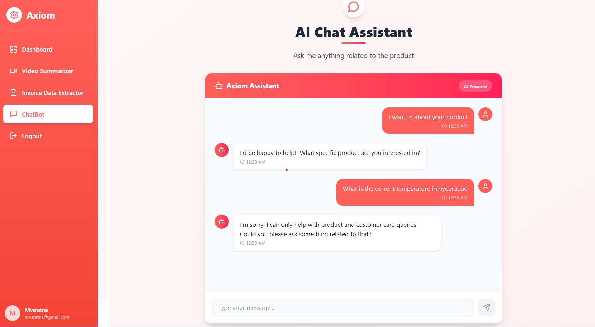

# Axiom

## Overview
This project automates various business processes using AI, reducing manual effort and improving efficiency. The system integrates multiple features including document processing, email analysis, video summarization, and a chatbot for customer service.

## Features

### 📧 Email Analysis & Negative Review Detection
- Retrieves and analyzes organization-wide emails to flag negative or frustrated messages.
- Uses a custom-trained logistic regression model combined with Google Generative AI for accurate sentiment detection.
- Classifies emails as frustrated or negative based on content.
- Generates a summary of the reasons for frustration found in the emails, which is downloadable.

🔹 **Technologies Used**: Google Gmail API, Logistic Regression, Gemini AI

### 🎥 Video Summarization
- Generates bullet points and summary documents from video content.
- Uses NLP techniques to extract key points and summarize.
- Supports translation of the generated summary into multiple languages (English, Spanish, French, German).

🔹 **Technologies Used**: AV, Whisper, Soundfile, Librosa, NLTK, Scikit-learn, Google Generative AI (Gemini), Google Translate API

### 📄 Document Processing & Conversion
- Automatically extracts PDF invoices from emails (using a subject filter) and converts them into Excel spreadsheets.
- Allows users to upload files for data extraction.
- Selectively retrieves specific data fields from PDFs based on user selection and converts them into Excel format.

🔹 **Technologies Used**: PyPDF2, Camelot, ReportLab, Google Gmail API

### 🤖 Chatbot Integration
- Provides a conversational AI interface to assist with product-related queries and customer service.

🔹 **Technologies Used**: Google Generative AI (Gemini)

### **Demo:** [https://drive.google.com/file/d/1DOP9mGKBkDkzn1UlFG47bkVxw0bkx4Wh/view?usp=sharing]


## Workflow


This diagram illustrates the flow of data and processes within the Axiom project.

## Implementation Details

### Technologies Used
- **AI Models**: Custom-trained logistic regression model, TF-IDF vectorization, Google Gemini API, OpenAI Whisper
- **Data Processing**: Pandas, NumPy, PyPDF2, Whisper
- **Frontend**: React, Tailwind CSS
- **Backend**: Flask (Python)
- **Database**: Firebase
- **Cloud Services**: Google Cloud, Firebase Authentication

### Design Approach

1. **Email Analysis:** The system fetches emails using the Gmail API, then analyzes the content using a combination of custom-trained logistic regression models and the Google Gemini API to identify sentiment and potential frustration. A summary of the reasons for frustration is then generated and made downloadable. The custom model achieves an accuracy score of 95.81%.

2. **Video Summarization:** Video files are processed by extracting the audio track, transcribing it using OpenAI Whisper, and then summarizing the resulting text using NLP techniques. The generated summary can be translated into multiple languages.

3. **Document Processing:** PDF invoices are automatically extracted from emails (based on subject line) or uploaded directly. The system then extracts relevant data from the invoices using libraries like PyPDF2 and Camelot, and converts the data into Excel spreadsheets. Users can select specific columns to extract from the PDF, and only those columns will be included in the Excel sheet.

4. **Chatbot Integration:** A conversational AI interface, powered by the Google Gemini API, provides users with assistance for product-related queries and customer service.

### Code Quality and Testing

- **Comprehensive Comments:** The codebase is thoroughly commented to ensure readability and ease of understanding for new developers.
- **Unit Tests:** Unit tests are included to verify the functionality of the core components, ensuring the reliability and correctness of the system.

### Scaling Considerations
- Can handle high email volumes efficiently.
- Designed to process long-form video transcriptions with improved summarization capabilities.
- Supports real-time document conversion for large datasets.

## Future Enhancements
- Extract data from social media posts related to the product, analyze sentiment, and identify the main reasons for customer dissatisfaction.
- Automated email responses for frequently asked queries.
- Expanding video processing to handle longer durations effectively.
- Tracking organizational expenses by categorizing invoice data.
- Exploring BERT-based models if GPU resources allow.

## Installation & Usage

### Prerequisites

- Node.js and npm installed (for frontend and Node.js scripts)
- Python 3.x installed (for backend)
- pip package installer (for Python dependencies)
- Google Cloud project set up with the Gemini API enabled
- Firebase project set up
- Google API credentials configured (Gmail API)
- Gemini API key configured (.env file required)
- Firebase credentials configured (firebase-config.js)
- Firebase service account key configured (serviceAccountKey.json)

### Setup

1. **Clone the repository:**

    ```sh
    git clone https://github.com/manvitha984/Axiom.git
    cd your-repo
    ```

2. **Frontend Setup (React with Vite and Tailwind CSS):**

    ```sh
    cd frontend
    npm install
    npm run dev
    ```

3. **Backend Setup (Flask):**

    ```sh
    cd ../backend
    pip install -r requirements.txt  # Install backend dependencies
    python server.py
    ```

Add necessary credentials:
1. `credentials.json` - Add the required details
2. `.env` - Add the Gemini API key
3. `firebase-config.js` - Add Firebase credentials
4. `serviceAccountKey.json` - Add the Firebase service account key

## Screenshots

Here are some screenshots of the Axiom project in action:







